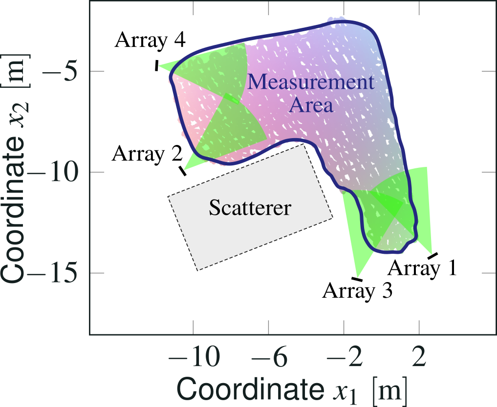
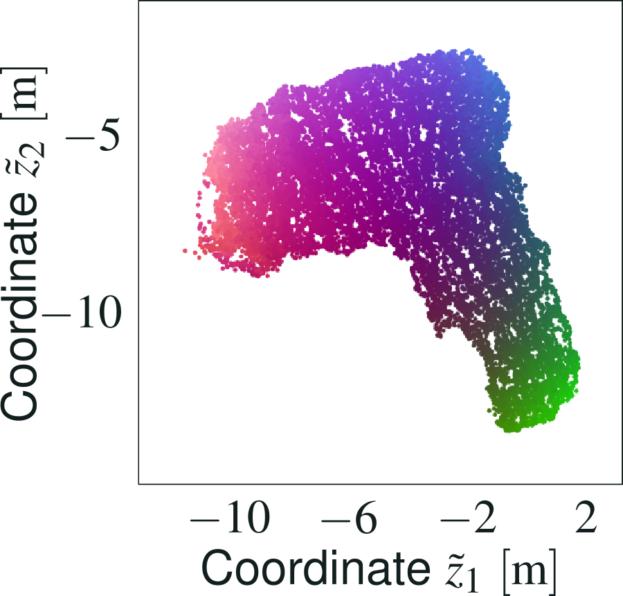

# Uncertainty-Aware Dimensionality Reduction for Channel Charting with Geodesic Loss

This repository contains partial source code for the results presented in the paper

> Florian Euchner, Phillip Stephan, Stephan ten Brink: "Uncertainty-Aware Dimensionality Reduction for Channel Charting with Geodesic Loss"

presented at the Asilomar Conference on Signals, Systems, and Computers in October 2024.

### Summary
The paper suggests three ways to improve the localization accuracy of Channel Charting:
* **Batch-wise training architecture and acceleration constraint**: Instead of a Siamese neural network architecture, feed the complete dataset into the neural network for every batch. This provides a global view of the channel chart in the loss function definition, which facilitates the introduction of an *acceleration constraint*, which means we take into account the physical inertia of the transmitter.
* **Geodesic loss**: With the new batch-wise loss calculation, we can compare geodesic distances in the channel chart to geodesic distances calculated on the CSI manifold. This greatly improves the channel chart if the low-dimensional representation (the true physical positions) have a non-convex shape. Previously, such cases lead to distortion, because we were "comparing apples (geodesic distances on the manifold) to oranges (Euclidean distances in the channel chart)".
* **Uncertainty model**: Instead of assuming that dissimilarity metrics provide some deterministic distance measure, we model the distance given a dissimilarity observation as a random variable. This allows us to take uncertainty information about dissimilarities into account.

## Results
### Dataset


The localization performance was evaluated on [the *dichasus-cf0x* dataset](https://dichasus.inue.uni-stuttgart.de/datasets/data/dichasus-cf0x/), which makes these results comparable to previous work using the same dataset.

### Using All Antenna Arrays
#### Channel Charts, Ground Truth, Training
Reference Positions (Tachymeter) | Antenna Array Numbering Scheme
:-:|:-:
 | 

**Training Animation**

Note how the paths through the channel chart become more and more fine-grained as the subsampling factor decreases. The final performance is only reached in the last few training batches.


Channel Chart | Channel Chart Error Vectors
:-:|:-:
 | 

You can find detailed results in the paper.

#### Performance Comparison
| **Method** | **MAE** | **DRMS** | **CEP** | **R95** | **KS** | **CT / TW**
| -: | :-: | :-: | :-: | :-: | :-: | :-
| [Classical ToA + AoA](https://arxiv.org/abs/2312.01968) | 0.676 m | 1.228 m | 0.462 m | 1.763 m | 0.214 | 0.965/0.970 |
| [Siamese CC](https://dichasus.inue.uni-stuttgart.de/tutorials/)* | 0.490 m | 0.584 m | 0.441 m | 1.026 m | 0.071 | 0.996/0.996 |
| [Augmented CC (Classical + CC)](https://arxiv.org/abs/2312.01968) | 0.401 m | 0.483 m | 0.369 m | 0.789 m | 0.070 | 0.995/0.995 |
| **This Paper*** | **0.295 m** | **0.375 m** | **0.234 m** | **0.719 m** | **0.069** | **0.998/0.998** |

* *MAE / DRMS / CEP / R95 evaluated after optimal affine transform
* MAE = mean absolute error, DRMS = distance root mean squared, CEP = circular error probable, R95 = 95<sup>th</sup> error percentile, KS = Kruskal Stress, CT/TW = Continuity / Trustworthiness

#### Empirical Cumulative Distribution Function of Absolute Localization Error


### Using a Single Antenna Array
Even with just a single antenna array, localization is possible in many cases.
This is one example where classical AoA / ToA-based techniques clearly fall short, because there is no simple classical localization technique that works with just one antenna array.

Here are some channel charts that were learned from CSI data from just one antenna array:

Only Array 1 | Only Array 2
:-:|:-:
 | 

Only Array 3 | Only Array 4
:-:|:-:
 | 

## Prerequisites
Our code is based on Python, TensorFlow, NumPy, SciPy and Matplotlib.
Source files are provided as Jupyter Notebooks, which can be opened directly here on GitHub or using, e.g., [JupyterLab](https://jupyter.org/).

We run our Channel Charting experiments on a JupyterHub server with NVMe storage, AMD EPYC 7262 8-Core Processor, 64GB RAM, and a NVIDIA GeForce RTX 4080 GPU for accelerating TensorFlow.
All indications of computation times are measured on this system.

## How to use

* First, run `1_DownloadDataset.ipynb` to obtain the `dichasus-cf0x` dataset in `rev2` version.
* Then, either run `1_AllAntennas.ipynb` to learn a Channel Chart using CSI data from all antenna arrays or
* run `2_OneArray.ipynb` to learn a Channel Chart using CSI data from just one antenna array. You can select the antenna array to use `b = 1/2/3/4` in the notebook.

## Citation
```
@inproceedings{euchner2024uncertainty,
	author    = {Euchner, Florian and Stephan, Phillip and ten Brink, Stephan},
	title     = {{Uncertainty-Aware Dimensionality Reduction for Channel Charting with Geodesic Loss}},
	booktitle = {Asilomar Conference on Signals, Systems, and Computers},
	year      = {2024}
}
```

## Other Resources
* [Christoph Studer's Channel Charting Website](https://channelcharting.github.io/)
* [The original Channel Charting paper](https://arxiv.org/abs/1807.05247)
* [DICHASUS Website](https://dichasus.inue.uni-stuttgart.de/)
* [Our tutorial on dissimilarity metric-based Channel Charting](https://dichasus.inue.uni-stuttgart.de/tutorials/tutorial/dissimilarity-metric-channelcharting/)
* [Our paper on dissimilarity metric-based Channel Charting](https://arxiv.org/abs/2308.09539)
* [Our paper on augmented Channel Charting](https://arxiv.org/abs/2312.01968)